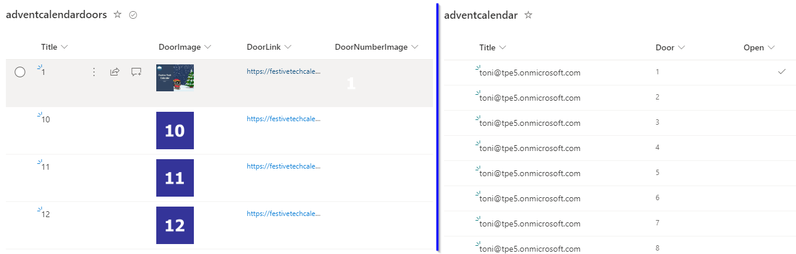
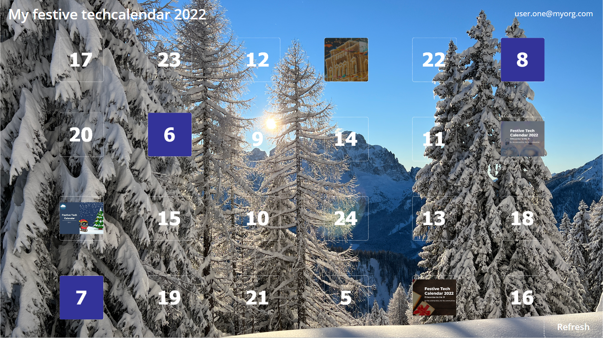
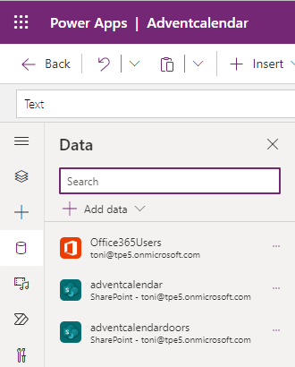
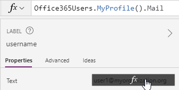
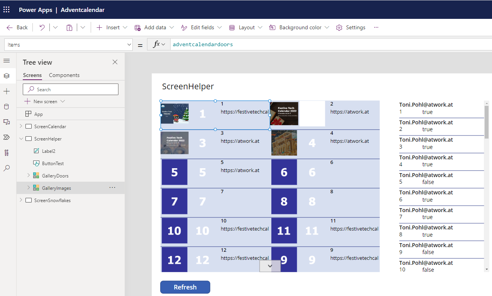
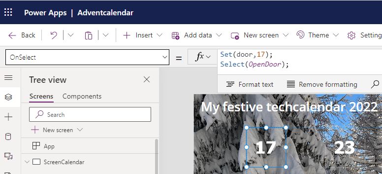
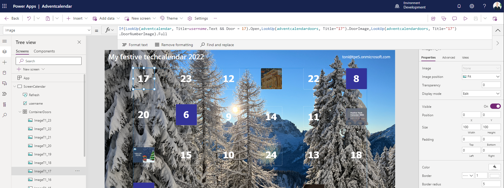
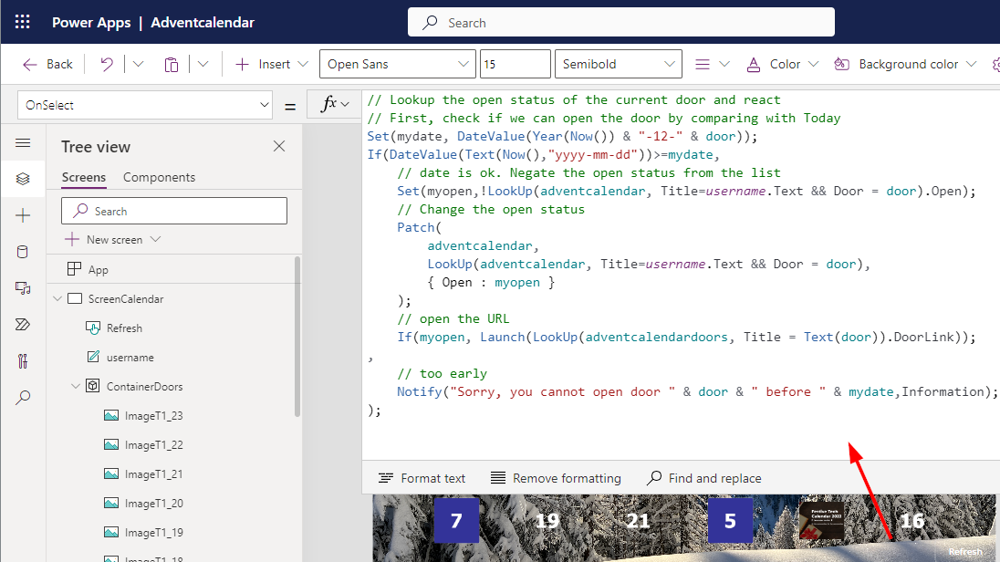
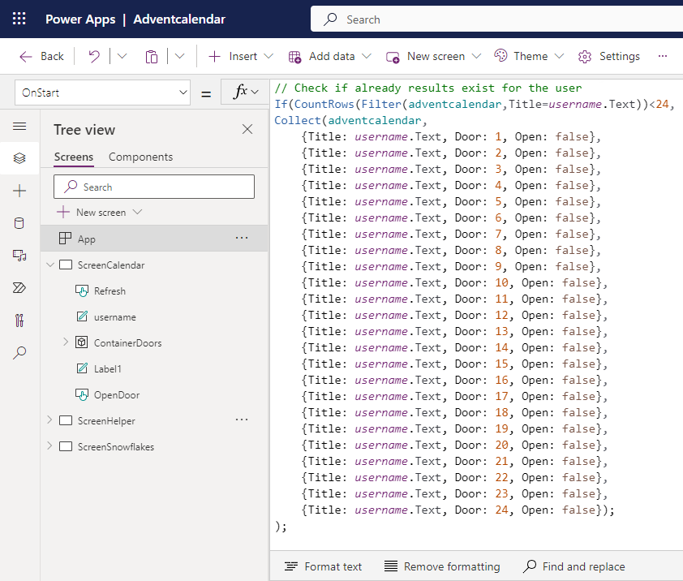

# PowerAppAdventCalendar

This is an advent calendar created with Microsoft Power Apps.

Christmas is near. As a contribution to the festivetechcalendar.com, I describe here how to create an advent calendar with Microsoft Power Apps. You can download the Power App and use this app and this article to learn useful concepts in Power Apps. Here we go.

## Requirements

The Power Apps Advent Calendar is designed to work like a real one, with the following rules.
- The advent calendar should be usable for all (or specific) users in the company (who have a Power App license assigned). Every user should get their own advent calendar. Eventually, we add the advent calendar in Teams.
- The doors should be filled with a picture. We need an image for each day (the number) and which image to display when a door has been opened, so 2 images for each door.
- A user can open 24 doors, but not before the specified date.
- The status of the opened and closed doors must be saved for each user. We need a place where we can store this data.

## Data storage

In our example, we use SharePoint Online to store two pieces of information: A list adventcalendardoors for the advent calendar images with the open and closed door graphics, including a link to open when the user opens a door. A second list adventcalendar stores all replies per user for the 24 days. The screenshot below shows the two custom lists with their columns.

As we see, adventcalendardoors (left) stores the open and closed image per door (Title), and the link to open. DoorNumberImage includes a picture with the door number only, and with transparent background. DoorImage includes the picture for an opened door. This list has to be filled with 24 rows for our 24 days, images, and links. We are completely flexible in what images and hyperlinks we use here.

In order for the app to work, this list must first be filled with the 24 lines and images.

adventcalendar (right) will be filled automatically by our Advent Calendar app. If a user opens the app, and there are no responses existing, the app will create 24 rows per user to store the status of the open and closed doors. One row consists the username (the UPN is stored in the Title column), the Door number (an integer), and the Open column (a boolean value with default False or No).

The list and the fields must exist, but the content will be filled by our app.

## The Advent Calendar App

When the two SPO lists are existing, we can create a new Canvas Power App named AdventCalendar. The app will have two screens: A screen called ScreenCalendar showing the advent calendar and to develop and test a ScreenHelper to visualize the data. Here´s the ScreenCalendar in action.

Note: You can download the Power App from [here](./tree/main/AdventcalendarApp) and import it into your own environment. The app can then be used and analyzed.

The screen´s background image can be filled with any picture. In my sample, I took this picture last winter at Sanctuary of Monte Lussari in Italy. In the top right corner, there is a label named username to show the currently signed-in user. We need that information for the calendar status. For multiple controls, I am a fan of using containers, see also a good video from Shane Young at Stop making useless Groups in Power Apps! Containers for the win. This container will contain 24 images, one for each door. We will add them later.

## Required connectors and binding data

Now let´s add the connectors to access the required data. Add the Office365Users connector to get the currently signed-in user. Then, add the two SharePoint lists adventcalendar and adventcalendardoors  from the site. The data connectors should look like here, with your user.

We can now access the data with the name of the connector: Office365Users, adventcalendar, and adventcalendardoors.

## Get the current user

With the connectors, we can modify the username label in the top right corner and change the Text to formula

~~~~
Office365Users.MyProfile().Mail
~~~~

This shows the currently signed-in user.

We can now reference to that control and take the username.Text property for querying the open and closed doors for the signed-in user.

## Show the data for development

For development, it can be helpful to visualize the data we need for showing the doors and the user´s status per door. For that, we add another screen named ScreenHelper and two vertical galleries. For the left gallery named GalleryImages we set the Data source to our SPO list adventcalendardoors. GalleryImages should show 24 rows for the doors in the calendar. The content of the galleries shows the columns as image and text. ´´

For the right gallery named GalleryDoors we set the Data source to our SPO list adventcalendar. Here, we filter the Items to Filter(adventcalendar,Title=username.Text). We are only interested in the data for the current signed-in user. GalleryDoors then only should show 24 rows for the current username. 

By the way, it's a good habit to always name objects with a descriptive name. GalleryImages is better readable and better to use and to reference than Gallery5, Text1, etc.

Note: To show more than one column in a vertical gallery, we can set the Wrap property to the number of columns, like 2. Using a gallery for our calendar does not work, since when we change the property of one single image, all images in the gallery will change. Therefore, we only use this gallery to explain and present the data for development. The whole ScreenHelper is not required for the functionality of the advent calendar, it´s optional, but can be helpful.

## The door image logic

Back to ScreenCalendar. Here we add a button control, name it OpenDoor and place it on the bottom right of the screen.This button is set to Visible = Off. We add code here later.

In the container, we add one single Image control. The name of the control is not relevant (unfortunately, there is still no method to reference the Self object by name). We will use a simple logic:

- The image shall show the door number, which is by default the closed door image.
- To open a door, the user clicks on it.
- When opened, the image shall show the opened door image.
- Each click changes the state: if open, then closed. If closed, then open.
- If opened, open a browser to show the link that is defined for the current door. This is the purpose of the Advent Calendar, to display an article or video in the browser next to the open door.

While this may sound complex, we actually only need two trigger events of the image: The Image property to set the image to opened or closed, and the OnSelect trigger to define what shall happen when the user clicks on it. Let´s start with formula for the OnSelect trigger of the Image property.

We ask the adventcalendar list for the username and a specific door number, like "1" for door 1. If the column Open is set to true, we know, the door must be shown as opened. If Open is set to false, we must show the closed door image.

~~~~
// Image1.OnSelect: replace the number for each image control
Set(door,1);
Select(OpenDoor);
~~~~

Here, we use a trick: Actually we would need to add the desired logic to each of the 24 doors. So, we just set a variable named door to the number of the door, 1 to 24. Then we call a (hidden) button called OpenDoor. This button has the logic to do what we defined earlier. This is a good workaround since Power Apps doesn't provide any functional logic.

Now let´s look at the formula of the Image property. We ask the adventcalendar list for the username and a specific door number, like 1. If the column Open is set to true, we know, the door must be shown as opened. If Open is set to false, we must show the closed door image. We get the images from the second SPO list, the adventcalendardoor list.

So, the Image property formula of one door graphics looks like here:

~~~~
// Image1.Image: replace the number for each image control
If(LookUp(adventcalendar, Title=username.Text && Door = 1).Open,
  LookUp(adventcalendardoors, Title="1").DoorImage,
  LookUp(adventcalendardoors, Title="1").DoorNumberImage
).Full
~~~~

We do a lookup in the adventcalendar list for the current user and for the current Door (which is 1 here). If the column Open for that row is true, we show the opened door image (for door "1" here). If Open is false, we show the closed door image - the number of the door with the transparent background. With this logic, we have a toggle functionality for the image. Note: The filter syntax is correct, since the Door column is of type number, while the Title column is of type text.

Now all we have to do is copy and paste the image control form another 23 times into the container and place the images. The image controls can have any name. Each image is 100 x 100 pixels. The container is 1100 x 640 pixels, enough space for 6 x 4 = 24 images. We place each control at an X position of +200 per column and a Y position of +170 for a new row.

Then each Image and each OnSelect formula must be modified with the door number. Place the image controls anywhere you want to get a random layout, like here.

## The OpenDoor button logic

Finally, we need to implement the logic called by each door's OnSelect action. Here follows the query as to whether the door can already be opened or not.

If so, we get the status of the door for the user and negate it: case open, then closed and vice versa. This is stored in the myopen variable. Now the row of data is written back to the data store (the list) with the new value. After that, the URL for the door will open in the browser.

If no, we inform the user that the date has not yet been reached.

~~~~
// OpenDoor.OnSelect: Lookup the open status of the current door and react
// First, check if we can open the door (December of the current year) by comparing with Today
Set(mydate, DateValue(Year(Now()) & "-12-" & door));

If(DateValue(Text(Now(),"yyyy-mm-dd"))>=mydate,
    // date is ok. Negate the open status from the list
    Set(myopen,!LookUp(adventcalendar, Title=username.Text && Door = door).Open);
    // Change the open status
    Patch(
        adventcalendar, 
        LookUp(adventcalendar, Title=username.Text && Door = door), 
        { Open : myopen }
    );
    // open the URL
    If(myopen, Launch(LookUp(adventcalendardoors, Title = Text(door)).DoorLink));
,
    // too early
    Notify("Sorry, you cannot open door " & door & " before " & mydate,NotificationType.Information);
);
~~~~

To test the check date functionality before December, modify the mydate, like here, or similar:

~~~~
Set(mydate, DateValue(Year(Now()) & "-" & Month(Now()) & "-" & door));
~~~~

Here´s the screenshot to show the context of the hidden button.

We´re almost done.

## Initialize data for the current user

We want to ensure that every user gets their advent calendar correctly initialized. If there is no advent calendar for the registered user, we create 24 lines to initialize the status for the doors in the adventcalendar list. This happens in the App.OnStart event.

~~~~
// App.OnStart
If(CountRows(Filter(adventcalendar,Title=username.Text))<24,
Collect(adventcalendar,
    {Title: username.Text, Door: 1, Open: false},
    {Title: username.Text, Door: 2, Open: false},
    ...,
    {Title: username.Text, Door: 24, Open: false});
);
~~~~

We check, if there are less than 24 rows existing for the signed-in user. If yes, we add new lines for the user. If enough rows are existing, we do nothing here.

The user data is then updated by the open/close actions per user with the Patch function in OpenDoor.OnSelect event.

This simple mechanism gives us the functionality we need to have a working advent calendar for every user running the app. This is it. Try it out!

## Power Apps

Build the app yourself or download the Power App [PowerAppAdventCalendar](./tree/main/AdventcalendarApp), import the app, and adapt it as needed. Of course, the advent calendar can still be expanded, for example with additional logic, falling snowflakes and more. I hope this article provides helpful tips and helps with creating your own apps.

Finally, I wish you a lot of fun with the other great contents of the Festivetechcalendar.com and a nice Advent season and a relaxing holiday season!
